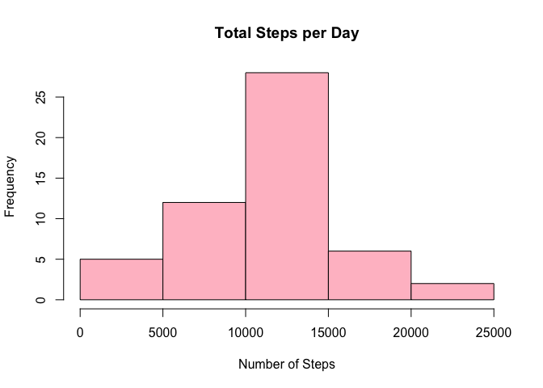
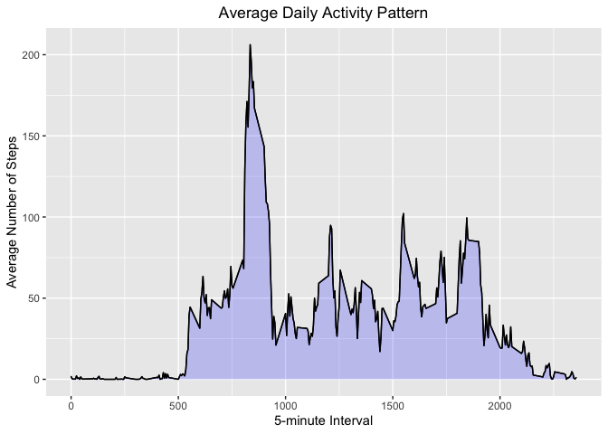
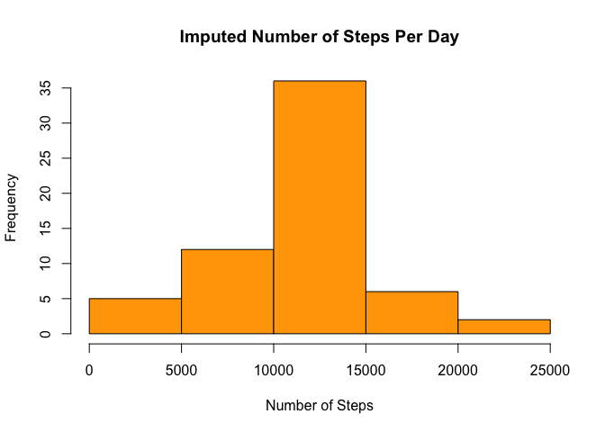
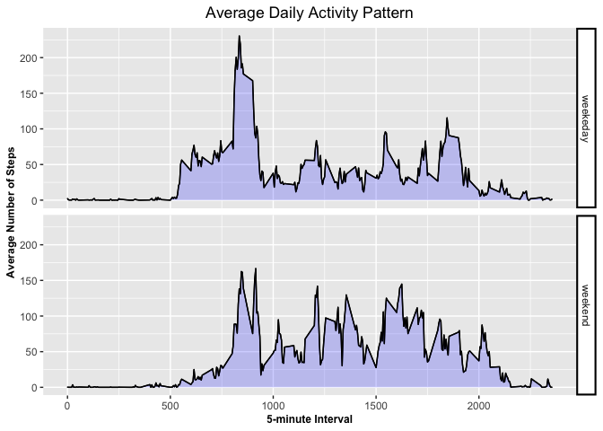

Global options applied


```r
knitr::opts_chunk$set(fig.path='Figs/')
```


##  Loading and preprocessing the data


```r
if (!file.exists('activity.csv')) {
  unzip(zipfile = "activity.zip")
}

activity_data <- read.csv(file="activity.csv", header=TRUE)
head(activity_data)
```

```
##   steps       date interval
## 1    NA 2012-10-01        0
## 2    NA 2012-10-01        5
## 3    NA 2012-10-01       10
## 4    NA 2012-10-01       15
## 5    NA 2012-10-01       20
## 6    NA 2012-10-01       25
```


##  Create a histogram of the total number of steps taken each day

###  What is the total number of steps taken per day?


```r
total_steps <- aggregate(steps ~ date, activity_data, FUN=sum)
sum(total_steps$steps)
```

```
## [1] 570608
```

### Histogram of total number of steps taken per day


```r
hist(total_steps$steps,
     main = "Total Steps per Day",
     xlab = "Number of Steps",
     col  = "pink")
```

<!-- -->


## What is the average daily activity pattern?

###  What is the Mean and median number of steps taken each day?


```r
mean(total_steps$steps, na.rm = TRUE)
```

```
## [1] 10766.19
```

```r
median(total_steps$steps, na.rm = TRUE)
```

```
## [1] 10765
```


### Time series plot of the average number of steps taken


```r
library(ggplot2)

mean_steps_by_interval <- aggregate(steps ~ interval, activity_data, mean)

ggplot(data = mean_steps_by_interval, aes(x = interval, y = steps)) +
  geom_line() +
  ggtitle("Average Daily Activity Pattern") +
  xlab("5-minute Interval") +
  ylab("Average Number of Steps") +
  geom_area(colour="black", fill="blue", alpha=.2) +
  theme(plot.title = element_text(hjust = 0.5))
```

<!-- -->


### Which 5-minute interval that, on average, contains the maximum number of steps?


```r
max_steps_Int <- mean_steps_by_interval[which.max(mean_steps_by_interval$steps),]
max_steps_Int
```

```
##     interval    steps
## 104      835 206.1698
```


## Imputing missing values

### Calculate and report the total number of missing values in the dataset


```r
sum(is.na(activity_data))
```

```
## [1] 2304
```


### Filling in the missing values 


```r
imp_activity_data <- transform(activity_data,
      steps = ifelse(is.na(activity_data$steps),
      mean_steps_by_interval$steps[match(activity_data$interval,       mean_steps_by_interval$interval)],activity_data$steps))
```


### Total number of steps taken each day after missing values are imputed


```r
imp_activity_Tsteps <- aggregate(steps ~ date, imp_activity_data, FUN=sum)
sum(imp_activity_data$steps)
```

```
## [1] 656737.5
```


### Mean and Median number of steps after imputing NA's


```r
mean(imp_activity_Tsteps$steps, na.rm = TRUE)
```

```
## [1] 10766.19
```

```r
median(imp_activity_Tsteps$steps, na.rm = TRUE)
```

```
## [1] 10766.19
```


Q: Do these values differ from the estimates from the first part of the assignment? What is the impact of imputing missing data on the estimates of the total daily number of steps?

A: Yes. The median after replacing NA's has become 10,765 that is a change from 10,766.19!
total daily number of 


### Histogram of the total number of steps taken each day after missing values are imputed


```r
hist(imp_activity_Tsteps$steps,
     main = "Imputed Number of Steps Per Day",
     xlab = "Number of Steps",
     col =  "orange")
```

<!-- -->


## Are there differences in activity patterns between weekdays and weekends?

### Create a new factor variable in the dataset with two levels,  "weekend" and "weekday"


```r
DayType <- function(date) {
  day <- weekdays(date)
  
  if (day %in% c('Monday', 'Tuesday', 'Wednesday', 'Thursday', 'Friday'))
      return ("weekeday")
  
  else if (day %in% c('Saturday', 'Sunday'))
      return ("weekend")
  
  else
      stop ("Invalid Date Format.")
}

imp_activity_data$date <- as.Date(imp_activity_data$date)

imp_activity_data$day <- sapply(imp_activity_data$date, FUN = DayType)
```


### Average number of steps taken across all weekdays or weekends


```r
mean_steps_by_day <- aggregate(steps ~ interval + day, imp_activity_data, mean)
```


### Make a panel plot containnig a time-series plot of the 5-minute interval and the average number of steps taken across all weekdays or weekends


```r
ggplot(data = mean_steps_by_day, aes(x = interval, y = steps)) + 
  geom_line() +
  facet_grid(day ~ .) +
  ggtitle("Average Daily Activity Pattern") +
  xlab("5-minute Interval") +
  ylab("Average Number of Steps") +
 
   theme(plot.title = element_text(hjust = 0.5), axis.title.x = element_text(color = "black", size = 9 , face = "bold"), axis.title.y = element_text(color = "black", size = 9, face = "bold"), strip.background = element_rect(colour="black", fill="white", size=1.5, linetype="solid")) +
  
  geom_area(colour="black", fill="blue", alpha=.2)
```

<!-- -->
